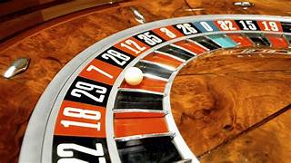

<h1>Casino Hunter</h1>

  
Casino Hunter is a C-based gambling game that offers various gaming options, allowing users to engage in activities such as roulette, coin flipping, rock-paper-scissors, and guessing the number.

  <h2>Features</h2>
    <ul>
        <li>User Accounts: Players can create and manage their accounts securely with password protection.</li>
        <li>Wallet Management: Users can easily deposit and withdraw funds from their wallets.</li>
        <li>Game Options: The game includes:
            <ul>
                <li><strong>Roulette</strong>: A classic casino game where players bet on where a ball will land on a spinning wheel.</li>
                <li><strong>Coin Flip</strong>: A simple game of chance where players guess the outcome of a coin toss.</li>
                <li><strong>Rock-Paper-Scissors</strong>: A quick decision-making game where players choose one of three options to beat their opponent.</li>
                <li><strong>Guess the Number</strong>: Players attempt to guess a randomly generated number within a specified range.</li>
            </ul>
        </li>
        <li>Admin Panel: Admins can view user data, manage wallets, and analyze game statistics to ensure smooth operation.</li>
        <li>Secure Password Handling: The game enforces strong password requirements to protect user accounts.</li>
        <li>Progressive Jackpots: Certain games feature progressive jackpots, allowing players to win a portion of the total bets placed.</li>
        <li>Leaderboards: Players can track their rankings and compare scores with others.</li>
        <li>Customization Options: Users can personalize their gaming experience with different themes and settings.</li>
    </ul>

  <h2>How to Use</h2>
    <ol>
        <li>Clone the Repository:</li>
        <pre><code>git clone https://github.com/kavyamittal28/UCA-project.git</code></pre>
        <li>Compile the Code:</li>
        <pre><code>gcc -o Casino_Hunter main.c</code></pre>
        <li>Run the Game:</li>
        <pre><code>./Casino_Hunter</code></pre>
    </ol>

  <h2>Dependencies</h2>
    <ul>
        <li>C compiler (e.g., GCC)</li>
        <li>Standard C libraries</li>
    </ul>

  <h2>File Structure</h2>
    <pre><code>UCA-project/
├── main.c
├── userdata.csv
├── transactions.csv
├── games/
│   ├── roulette.c
│   ├── coin_flip.c
│   ├── rock_paper_scissors.c
│   └── guess_the_number.c
├── admin/
│   ├── admin_panel.c
│   └── insights.c
└── [other source files]</code></pre>
<h2>Game Descriptions</h2>

    <ul>
        <li><strong>Roulette</strong>: Players place bets on numbers or colors, and a spinning wheel determines the winning number.</li>
        <li><strong>Coin Flip</strong>: A straightforward game where players guess heads or tails, with a 50% chance of winning.</li>
        <li><strong>Rock-Paper-Scissors</strong>: A game of strategy where each player simultaneously chooses one of three options, with specific outcomes determining the winner.</li>
        <li><strong>Guess the Number</strong>: Players attempt to guess a number within a defined range, with feedback provided after each guess to guide them.</li>
    </ul>

<h2>Contributing</h2>
    
Contributions are welcome! Please feel free to fork the repository and submit pull requests.

